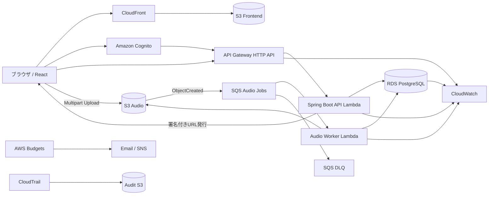

# Terraform・AWS構築手順書

- 調査日: 2026-07-21
- Excel作成日: 2026-08-11
- 対象リージョン: ap-northeast-1（東京）
- 通貨: 日本円
- 為替前提: 1 USD = 160円
- 標準利用時の想定月額: 約2,912円（税抜き）
- 予算目標: 月額5,000～8,000円以内
- 対象環境: 開発・検証環境1つ

---

# 1. 前提・概要

## 1.1 前提一覧

| 項目 | 内容 | 区分 | 仮定の有無 | 要確認事項 | 備考 |
|---|---|---|---|---|---|
| システム概要 | ブラウザ上でDAW機能を提供し、楽曲プロジェクト・音声ファイルを保存するWebアプリケーション | 確定 | なし | なし | リアルタイム共同編集は初期対象外 |
| 対象ユーザー | 認証済みユーザー | 確定 | なし | なし | 自分のデータだけへアクセス可能とする |
| フロントエンド | React 19 | 確定 | なし | なし | Next.jsは使用しない |
| バックエンド | Spring Boot 4.1.x | 方針 | なし | 利用ライブラリのJava 25互換性 | Lambda上で実行 |
| Java | Java 25を条件付き採用 | 方針 | あり | Gradle、JPA、AWS Serverless Java Container等の統合試験 | 問題発生時はJava 21へ切替可能とする |
| AWSリージョン | ap-northeast-1 | 確定 | なし | なし | ACMのCloudFront用証明書のみus-east-1 |
| データベース | Amazon RDS for PostgreSQL | 方針 | あり | 実データ量、接続数 | 初期はSingle-AZ |
| RDSインスタンス | db.t4g.micro | 仮定 | あり | 性能試験 | 標準100時間/月 |
| RDSストレージ | gp3 20GB | 仮定 | あり | 実使用量 | 停止中も課金継続 |
| 音声保存 | Amazon S3 | 確定 | なし | ファイルサイズ・月間容量 | 非公開バケット |
| 音声アップロード | S3署名付きURL + Multipart Upload | 方針 | なし | 最大ファイルサイズ | API Gateway経由で本体を送らない |
| 非同期処理 | Amazon SQS + AWS Lambda | 方針 | なし | 実際の処理時間 | DLQを使用 |
| フロント配信 | Amazon CloudFront + 非公開S3 + OAC | 方針 | なし | 独自ドメイン要否 | HTTPS配信 |
| 認証 | Amazon Cognito | 確定 | なし | MFA方針 | APIはJWT Authorizer |
| コスト条件 | 月額5,000～8,000円以内 | 制約 | なし | 実利用量による | 無料枠は主計算から除外 |
| 為替 | 1 USD = 160円 | 仮定 | あり | 実請求時レート | 予算計画用 |
| RDS利用時間 | 最小40h、標準100h、増加時730h | 仮定 | あり | 実開発時間 | 7日停止後の自動起動に注意 |
| S3容量 | 10GB、50GB、200GB | 仮定 | あり | 実音声容量 | 3パターン試算 |
| CloudFront転送 | 5GB、50GB、500GB | 仮定 | あり | 実転送量 | 音声再生量の影響大 |
| CloudWatch Logs | 0.5GB、2GB、10GB | 仮定 | あり | 実ログ量 | retentionを設定 |
| セキュリティ方針 | 最小権限、RDS非公開、S3非公開、HTTPS、暗号化、所有権認可 | 方針 | なし | 本番要件 | 初期は過剰構成を避ける |
| Terraform管理方式 | 環境別ディレクトリ方式 | 方針 | なし | staging/prod追加時の運用 | Workspace方式は採用しない |
| tfstate | S3 backend | 方針 | なし | bootstrap stateの保管 | versioning有効 |
| state locking | S3ネイティブlockfile | 方針 | なし | Terraform実装時の最終確認 | DynamoDBロックは新規採用しない |
| CI | GitHub Actions + OIDC | 方針 | あり | 利用Gitホスティング | 長期AWSキーを置かない |
| 重要制約 | NAT Gatewayを常設しない | 制約 | なし | 外部API通信が必要になった場合 | 予算超過防止 |
| 重要制約 | WAF・RDS Proxyは初期常設しない | 制約 | なし | 公開後の負荷・攻撃状況 | 後付け可能 |
| 調査日 | 2026-07-21 | 確定 | なし | 実装開始時に料金再確認 | 公式情報ベース |
| Excel作成日 | 2026-08-11 | 確定 | なし | なし | Markdown版も同日作成 |

## 1.2 推奨アーキテクチャ概要



### 基本フロー

1. ReactはCloudFront経由で非公開S3から配信する。
2. Amazon Cognitoでログインし、アクセストークンを取得する。
3. API Gateway HTTP APIのJWT Authorizerでトークンを検証する。
4. Spring Boot LambdaがCognito `sub`を所有者IDとしてREST APIを処理する。
5. メタデータはRDS PostgreSQLへ保存する。
6. 音声本体はAPI Gatewayを経由せず、署名付きURLでブラウザからS3へ直接送る。
7. S3イベントをSQSへ送信し、音声処理Lambdaが非同期で変換・波形生成する。
8. CloudWatchでログ・メトリクス・アラームを管理する。
9. AWS Budgetsで予算超過を監視する。
10. NAT Gatewayは使用しない。

---

# 2. 構成案比較

| 評価項目 | 構成案A | 構成案B | 構成案C | 推奨案 | 推奨理由 | 注意事項 |
|---|---|---|---|---|---|---|
| 構成概要 | Lambda + RDS中心のサーバーレス | ECS Fargate + ALB | Lambda + DynamoDB中心 | A | 必須サービスを実アプリへ自然に組み込みつつ固定費を抑えられる | RDS接続数に注意 |
| Reactの配信方式 | CloudFront + S3 | CloudFront + S3 | CloudFront + S3 | A | 3案共通で適切 | S3は非公開 |
| Spring Bootの実行方式 | AWS Lambda | ECS Fargate | AWS Lambda | A | 使用時課金で開発環境に適合 | SnapStartを検討 |
| データベース | RDS PostgreSQL | RDS PostgreSQL | DynamoDB、RDSは学習用 | A | 必須RDSを実アプリで検証できる | Single-AZ前提 |
| 音声ファイル保存 | S3 | S3 | S3 | A | 大容量ファイルに適する | Presigned URLを使用 |
| 非同期処理 | SQS + Lambda | SQS + ECS/Lambda | SQS + Lambda | A | 再試行・DLQを低コストで実装可能 | 冪等性が必要 |
| ネットワーク構成 | NATなし、Private RDS | ALB/VPC/NATまたはEndpoint多数 | NATなし | A | 固定費削減 | 外部API利用時は再検討 |
| コスト | 低～中 | 高 | 最低 | A | 予算と必須サービスの両立 | RDS停止忘れ注意 |
| 運用性 | 高 | 中 | 高 | A | サーバー常駐管理が不要 | Lambda固有の制約あり |
| セキュリティ | 高 | 高 | 高 | A | RDS・S3を非公開化できる | JWTと所有権認可を分離 |
| 拡張性 | 中～高 | 高 | 高 | A | 初期規模には十分 | 長時間処理はFargate等へ移行 |
| Terraformの複雑さ | 中 | 高 | 中 | A | ECS/ALB/NATを避けられる | stack分割は必要 |
| 初心者の理解しやすさ | 中 | 低 | 中 | A | AWS主要サービスの役割が分かりやすい | module過分割を避ける |
| ブラウザDAWへの適合性 | 高 | 高 | 中～高 | A | S3直接アップロードと非同期処理が適合 | 音声容量を継続監視 |
| 削除の容易さ | 高 | 中 | 高 | A | stack単位に分離可能 | データ系は手動確認が必要 |
| 主なリスク | RDS接続、cold start | 固定費、複雑性 | RDSを本体で使わない | A | リスクを制御しやすい | Java 25統合試験を行う |

---

# 3. AWSサービス一覧

| No. | サービス | 分類 | 用途 | 採用理由 | 採用しない場合の影響 | 初期導入 | 将来導入 | 依存サービス | コスト要因 | セキュリティ上の注意 | 運用上の注意 | 削除時の影響 | 推奨度 | 備考 |
|---:|---|---|---|---|---|---|---|---|---|---|---|---|---:|---|
| 1 | Amazon S3 | 必須 | React、音声、state、監査ログ | 大容量保存と直接アップロードに適する | 音声・静的ファイル保存不可 | 必須 | 継続 | CloudFront、Lambda、SQS | 容量、PUT/GET、転送 | Block Public Access、暗号化 | lifecycle、未完了Multipart削除 | データ消失 | 5 | 必須検証対象 |
| 2 | AWS Lambda | 必須 | REST API、音声処理、運用処理 | 使用時課金 | 常設サーバーが必要 | 必須 | 継続 | API Gateway、SQS、RDS | GB秒、request | IAM最小権限、同時実行制限 | timeout、memory、cold start | API/処理停止 | 5 | Java 25条件付き |
| 3 | Amazon API Gateway | 必須 | REST API公開 | HTTP APIが低コスト | 独自API公開基盤が必要 | 必須 | 継続 | Lambda、Cognito | request数 | JWT Authorizer、throttle | 4XX/5XX監視 | API停止 | 5 | HTTP APIを採用 |
| 4 | Amazon Cognito | 必須 | ユーザー認証 | JWT連携が容易 | 独自認証が必要 | 必須 | 継続 | API Gateway | MAU、SMS | MFA、token用途 | ユーザー削除に注意 | ログイン不可 | 5 | `sub`を所有者IDに使用 |
| 5 | Amazon RDS for PostgreSQL | 必須 | プロジェクトメタデータ | 関係モデルと整合性 | DB方式変更が必要 | 必須 | 継続 | VPC、Lambda | 時間、storage、backup | 非公開、TLS、IAM DB Auth | 停止7日後自動起動 | メタデータ消失 | 5 | db.t4g.micro想定 |
| 6 | Amazon SQS | 必須 | 音声処理キュー、DLQ | 非同期・再試行・平準化 | APIと処理が密結合 | 必須 | 継続 | S3、Lambda | request数 | 暗号化、DLQ | retry loop監視 | 未処理ジョブ消失 | 5 | Standard Queue |
| 7 | Amazon CloudFront | 必須 | React配信 | HTTPS、OAC、cache | S3直接配信等が必要 | 必須 | 継続 | S3、ACM | 転送、request | OAC、TLS | cache invalidation | フロント停止 | 5 | 音声配信は初期Presigned URL中心 |
| 8 | Amazon Route 53 | 条件付き採用 | 独自ドメイン | CloudFront Aliasが容易 | CloudFront既定ドメインで代替 | 任意 | あり | ACM、CloudFront | Hosted Zone、DNS | DNS変更管理 | 不要Zone削除 | 名前解決停止 | 3 | 独自ドメイン時 |
| 9 | AWS Certificate Manager | 条件付き採用 | TLS証明書 | CloudFrontと統合 | CloudFront既定ドメインで代替 | 任意 | あり | CloudFront | 原則低コスト | CloudFront用はus-east-1 | 更新状態確認 | 独自HTTPS停止 | 4 | 非export証明書前提 |
| 10 | Amazon CloudWatch | 必須 | Logs、Metrics、Alarms | 障害検知に必要 | 障害原因調査困難 | 必須 | 継続 | 全サービス | Logs、Alarm | 機密情報を記録しない | retention設定 | 監視履歴消失 | 5 | ログ量を監視 |
| 11 | AWS Budgets | 必須 | 予算通知 | 料金超過を早期検知 | 超過発見が遅れる | 必須 | 継続 | Billing | 通常低コスト | 通知先管理 | 閾値見直し | アプリ影響なし | 5 | 4千/6千/8千円相当 |
| 12 | AWS Cost Explorer | 推奨 | コスト分析 | サービス別費用を確認 | 詳細分析が難しい | 推奨 | 継続 | Billing | API利用 | Billing権限限定 | 月次確認 | アプリ影響なし | 4 | API呼出しは最小限 |
| 13 | AWS CloudTrail | 必須 | 操作監査 | 誤操作追跡 | 原因調査困難 | 必須 | 継続 | S3任意 | データイベント等 | Audit S3保護 | Data Events初期無効 | 監査履歴消失 | 5 | Management Events中心 |
| 14 | IAM Access Analyzer | 推奨 | 外部公開検知 | 誤公開検知 | 露出を見逃す | 推奨 | 継続 | IAM、S3 | 高度機能 | findings確認 | 定期確認 | アプリ影響なし | 4 | External Access中心 |
| 15 | AWS Systems Manager Parameter Store | 推奨 | 非機密設定 | Standardを低コスト利用 | 環境変数等で代替 | 推奨 | 継続 | Lambda | Advanced等 | SecureString用途区別 | 値の命名管理 | 設定読込不可 | 4 | 秘密値はSecrets Manager |
| 16 | AWS Secrets Manager | 推奨 | RDSマスターシークレット | RDS管理パスワードに適する | 手動秘密管理が必要 | 推奨 | 継続 | RDS | secret月額 | stateへ出力しない | secret乱立回避 | DB管理接続へ影響 | 4 | 通常アプリはIAM DB Auth |
| 17 | AWS WAF | 条件付き採用 | 攻撃・不正利用対策 | 公開後の防御力向上 | throttle等で一部代替 | 初期非採用 | 条件付き | CloudFront/API Gateway | ACL、Rule、request | Countから導入 | 予算影響大 | 防御力低下 | 2 | 初期常設しない |
| 18 | Amazon ECR | 学習・検証用 | コンテナイメージ保存 | Lambda container検証 | ZIP/JARなら不要 | 検証のみ | 条件付き | Lambda/ECS | storage | image scan | lifecycle | 本体影響なし | 2 | 本番APIでは不採用 |
| 19 | AWS Backup | 条件付き採用 | バックアップ統合 | 将来一元化できる | 各サービス機能で代替 | 初期非採用 | 条件付き | RDS、S3 | GB-month、restore | Vault policy | 保持期限 | backup管理停止 | 2 | 初期はRDS自動backup |
| 20 | Amazon EventBridge Scheduler | 推奨 | RDS停止、定期運用 | 停止忘れ防止 | 手動運用 | 推奨 | 継続 | Lambda、RDS | 実行回数 | Role最小権限 | schedule確認 | 自動停止不可 | 5 | コスト対策上重要 |
| 21 | Amazon SNS | 推奨 | Alarm通知 | 通知統合 | 個別通知で代替 | 推奨 | 継続 | CloudWatch | 通知数 | Topic policy | subscription管理 | 通知停止 | 3 | Email通知中心 |
| 22 | Amazon RDS Proxy | 条件付き採用 | 接続プール | Lambda高並列時に有効 | concurrency制御で代替 | 初期非採用 | 条件付き | RDS、Lambda | 稼働時間 | 認証、SG | 接続メトリクス監視 | 高負荷時影響 | 2 | 問題顕在化後に追加 |
| 23 | NAT Gateway | 非推奨 | Private Subnet外向き通信 | 今回は不要 | VPC Endpoint等で代替 | 非採用 | 条件付き | VPC | 時間＋GB | route管理 | 固定費大 | 外向き通信停止 | 1 | 予算上最大リスク |

---

# 4. Terraformフォルダ構成

## 4.1 フォルダツリー

```text
infra/
├── README.md
├── docs/
│   ├── architecture.md
│   ├── cost-assumptions.md
│   ├── operation-runbook.md
│   └── destroy-runbook.md
├── bootstrap/
│   └── state-backend/
│       ├── versions.tf
│       ├── providers.tf
│       ├── main.tf
│       ├── variables.tf
│       ├── outputs.tf
│       └── terraform.tfvars.example
├── modules/
│   ├── network/
│   ├── frontend-storage/
│   ├── audio-storage/
│   ├── queue/
│   ├── cognito/
│   ├── rds/
│   ├── lambda-api/
│   ├── api-gateway/
│   ├── lambda-worker/
│   ├── cloudfront/
│   ├── dns-acm/
│   ├── monitoring/
│   ├── cost-control/
│   └── audit/
├── environments/
│   └── dev/
│       ├── 00-foundation/
│       ├── 10-storage-queue/
│       ├── 20-auth/
│       ├── 30-database/
│       ├── 40-backend/
│       ├── 50-frontend/
│       └── 60-operations/
├── sandboxes/
│   └── dev/
│       ├── lambda/
│       ├── api-gateway/
│       ├── cognito/
│       ├── rds/
│       ├── sqs/
│       ├── ecr/
│       └── backup/
└── scripts/
    ├── init.sh
    ├── plan.sh
    ├── apply.sh
    ├── smoke-test.sh
    ├── stop-rds.sh
    └── destroy-sandbox.sh
```

## 4.2 管理方針

- Terraform本体: `1.15.8`を基準に実装開始時再確認
- AWS Provider: `6.55.0`を基準に実装開始時再確認
- `.terraform.lock.hcl`: Git管理
- 環境管理: 環境別ディレクトリ方式
- state: 専用S3バケット
- state locking: S3 `use_lockfile = true`
- state bucket: versioning、Block Public Access、暗号化を有効化
- 機密値: `tfvars`へ平文保存しない
- CI認証: GitHub Actions OIDC
- dev本体とsandboxはstateを分離
- moduleは再利用可能なサービス境界で分割する
- `terraform_remote_state`はstack間の必要最低限のoutput共有に限定する

## 4.3 パス一覧

| No. | パス | 種別 | 役割 | 主なresource | 主なmodule | 主なdata source | 主なvariables | 主なlocals | 主なoutputs | 依存先 | 作成Step | 削除時の注意 | 備考 |
|---:|---|---|---|---|---|---|---|---|---|---|---:|---|---|
| 1 | `bootstrap/state-backend/` | bootstrap | tfstate基盤 | `aws_s3_bucket`等 | なし | `aws_caller_identity` | project、region | name_prefix | state bucket名 | なし | 1 | 原則手動で残す | 最後まで削除しない |
| 2 | `modules/network/` | module | VPC/Subnet/SG/Endpoint | VPC関連 | network | AZ等 | CIDR | subnet map | VPC/Subnet/SG | bootstrap | 3 | 依存resource削除後 | NATなし |
| 3 | `modules/frontend-storage/` | module | React用S3 | S3関連 | frontend-storage | IAM policy document | bucket設定 | bucket name | bucket名 | bootstrap | 4 | object/version削除 | Public Access禁止 |
| 4 | `modules/audio-storage/` | module | 音声用S3 | S3関連 | audio-storage | IAM policy document | lifecycle等 | prefix | bucket ARN | bootstrap | 5 | Multipart/version確認 | Presigned URL用 |
| 5 | `modules/queue/` | module | SQS/DLQ | `aws_sqs_queue` | queue | なし | retention、maxReceive | queue names | Queue/DLQ ARN | storage | 6 | message確認 | 音声非同期 |
| 6 | `modules/cognito/` | module | 認証 | Cognito関連 | cognito | なし | callback等 | naming | Pool/Client ID | bootstrap | 8 | user消失注意 | `sub`利用 |
| 7 | `modules/rds/` | module | PostgreSQL | RDS関連 | rds | AZ等 | class、storage | db naming | endpoint/port | network | 10 | final snapshot | deletion protection確認 |
| 8 | `modules/lambda-api/` | module | Spring Boot API | Lambda関連 | lambda-api | IAM policy | memory、timeout | log names | function ARN | RDS/Auth | 11 | alias/version確認 | SnapStart |
| 9 | `modules/api-gateway/` | module | HTTP API | API Gateway v2 | api-gateway | なし | routes | route map | API endpoint | Cognito/Lambda | 9/11 | route確認 | JWT Authorizer |
| 10 | `modules/lambda-worker/` | module | 音声処理 | Lambda/event source | lambda-worker | IAM policy | memory、timeout | log names | worker ARN | SQS/RDS/S3 | 14 | mapping先に削除 | DLQ前提 |
| 11 | `modules/cloudfront/` | module | React CDN | CloudFront/OAC | cloudfront | managed policy | domain/cache | origin IDs | distribution domain | frontend S3 | 15 | disable後削除 | OAC使用 |
| 12 | `modules/dns-acm/` | module | DNS/TLS | Route53/ACM | dns-acm | hosted zone | domain | records | cert ARN | CloudFront | 16 | DNS順序注意 | 条件付き |
| 13 | `modules/monitoring/` | module | Logs/Alarm | CloudWatch/SNS | monitoring | なし | thresholds | alarm names | Alarm ARN | backend等 | 17 | log残存確認 | retention設定 |
| 14 | `modules/cost-control/` | module | Budget等 | Budgets/Scheduler | cost-control | account情報 | budget | thresholds | Budget名 | bootstrap | 0/17 | Budget残存可 | 最優先 |
| 15 | `modules/audit/` | module | 監査 | CloudTrail/Analyzer | audit | IAM policy | retention | audit names | Trail ARN | S3 | 18 | audit log判断 | Data Events初期無効 |
| 16 | `environments/dev/00-foundation/` | ディレクトリ | dev基礎stack | module参照 | network | remote state等 | dev値 | common tags | foundation outputs | bootstrap | 3 | 下位stack先削除 | 環境別方式 |
| 17 | `environments/dev/10-storage-queue/` | ディレクトリ | S3/SQS | module参照 | storage/queue | remote state | dev値 | common tags | bucket/queue | foundation | 4-6 | object/message確認 | state分離 |
| 18 | `environments/dev/20-auth/` | ディレクトリ | Cognito | module参照 | cognito | なし | dev値 | common tags | pool/client | bootstrap | 8 | user確認 | state分離 |
| 19 | `environments/dev/30-database/` | ディレクトリ | RDS | module参照 | rds | foundation remote state | dev値 | common tags | endpoint | foundation | 10 | snapshot/deletion protection | state分離 |
| 20 | `environments/dev/40-backend/` | ディレクトリ | Lambda/API | module参照 | lambda-api/api-gateway/worker | remote states | artifact path等 | common tags | API URL | 10/20/30 | event source先削除 | state分離 |
| 21 | `environments/dev/50-frontend/` | ディレクトリ | CloudFront/DNS | module参照 | cloudfront/dns-acm | remote states | domain等 | common tags | distribution URL | storage/backend | 15 | CloudFront disable | state分離 |
| 22 | `environments/dev/60-operations/` | ディレクトリ | Monitoring/Audit | module参照 | monitoring/cost-control/audit | remote states | threshold等 | common tags | alarms | 全体 | 17-18 | log/監査を残す判断 | state分離 |
| 23 | `sandboxes/dev/*` | ディレクトリ | 個別学習 | 対象resource | 対象module | 最小限 | sandbox値 | sandbox tags | 検証値 | bootstrap | 19 | 各検証後destroy | 本体へ依存させない |
| 24 | `providers.tf` | Terraformファイル | AWS provider設定 | なし | なし | なし | region | default tags | なし | 各root | 各Step | rootごと管理 | default tags推奨 |
| 25 | `backend.tf` | Terraformファイル | S3 backend設定 | なし | なし | なし | backend値はCLI等 | なし | なし | bootstrap | 各root | bucket削除禁止 | secretを書かない |
| 26 | `variables.tf` | Terraformファイル | 入力定義 | なし | なし | なし | 各種 | なし | なし | 各root/module | 各Step | なし | secret default禁止 |
| 27 | `locals.tf` | Terraformファイル | 命名・タグ | なし | なし | なし | inputs | name_prefix等 | なし | 各root/module | 各Step | なし | 共通タグ |
| 28 | `outputs.tf` | Terraformファイル | 出力定義 | なし | なし | なし | なし | なし | ARN/ID等 | 各root/module | 各Step | secret出力禁止 | passwordを出さない |

---

# 5. 構築手順

## 5.1 共通Terraform実行順序

各root stackでは、原則として次の順で実行する。

```bash
terraform fmt -recursive
terraform init
terraform validate
terraform plan -out=tfplan
terraform apply tfplan
```

同一ディレクトリでprovider/module/backend設定に変更がない再実行では、`terraform init`は毎回必須ではない。ただし以下の場合は再実行する。

- backend設定を変更した
- providerバージョンを変更した
- module sourceを変更した
- `.terraform`を削除した
- 初回実行
- `terraform init -upgrade`を意図的に行う

## 5.2 Step一覧

| Step | フェーズ | 対象サービス | 目的 | 前提Step | 対象ディレクトリ | 主なresource | AWSでの確認 | 成功条件 | 削除方法 | 次Step |
|---:|---|---|---|---:|---|---|---|---|---|---|
| 0 | コスト管理 | AWS Budgets | 予算超過防止 | なし | `60-operations`または先行stack | `aws_budgets_budget` | Billing/Budgets | 通知先と閾値が確認できる | `terraform destroy` | 全Step |
| 1 | bootstrap | Amazon S3 | tfstate保存 | なし | `bootstrap/state-backend` | `aws_s3_bucket`等 | S3 console | versioning、暗号化、Public Block有効 | 原則削除しない | 全Step |
| 2 | 基礎 | Provider/IAM | 対象Account確認 | 1 | 各root | provider/data source | `aws sts get-caller-identity` | Account/Region一致 | Role等を個別削除 | 全Step |
| 3 | network | Amazon VPC | RDS隔離 | 1 | `00-foundation` | VPC/Subnet/SG/Endpoint | VPC console | RDS用private subnet、NATなし | 依存resource後にdestroy | 10 |
| 4 | storage | Amazon S3 | React保存 | 1 | `10-storage-queue` | S3 frontend | S3 console | anonymous access拒否 | object/version削除後destroy | 15 |
| 5 | storage | Amazon S3 | 音声保存 | 1 | `10-storage-queue` | S3 audio | S3 console | lifecycle/CORS/Public Block確認 | object/version/Multipart確認 | 12 |
| 6 | queue | Amazon SQS | 非同期基盤 | 1 | `10-storage-queue` | Queue/DLQ | SQS console | send/receive、DLQ設定 | message確認後destroy | 14 |
| 7 | compute検証 | AWS Lambda | Java 25単体確認 | 1 | `sandboxes/dev/lambda` | `aws_lambda_function` | Lambda test | Java 25で正常応答 | sandbox destroy | 9/11 |
| 8 | auth | Amazon Cognito | 認証 | 1 | `20-auth` | User Pool/Client | Cognito console | test userでtoken取得 | user消失確認後destroy | 9 |
| 9 | API | Amazon API Gateway | JWT付きHTTP API | 7,8 | `40-backend` | API GW v2/Authorizer | API Gateway console/curl | JWTなし401、正常JWT成功 | routes/API destroy | 11 |
| 10 | database | Amazon RDS | PostgreSQL | 3 | `30-database` | DB instance/Subnet Group | RDS console | private、available、接続成功 | final snapshot後destroy | 11/14 |
| 11 | backend | AWS Lambda | Spring Boot REST API | 9,10 | `40-backend` | API Lambda/Alias | curl/CloudWatch | CRUD、所有者分離成功 | API連携解除後destroy | 12 |
| 12 | upload | S3 Presigned URL | 直接アップロード | 5,11 | `40-backend` | IAM/API実装 | curl/browser/S3 | 指定keyだけupload成功 | object削除 | 13 |
| 13 | event | S3→SQS | 非同期イベント | 6,12 | `10-storage-queue` | `aws_s3_bucket_notification` | SQS message | uploadでmessage到着 | notification削除 | 14 |
| 14 | worker | AWS Lambda + SQS | 音声変換 | 10,13 | `40-backend` | Worker/Event Source Mapping | Lambda/S3/RDS | 出力生成、DB状態更新 | mapping→Lambda順 | 15 |
| 15 | frontend | CloudFront | React HTTPS配信 | 4,11 | `50-frontend` | Distribution/OAC | browser/CloudFront | S3直アクセス拒否、CF成功 | disable後destroy | 16 |
| 16 | domain | Route 53/ACM | 独自ドメイン | 15 | `50-frontend` | cert/record | DNS/HTTPS | 証明書正常、Alias応答 | DNS→CF→cert | 任意 |
| 17 | operations | CloudWatch/SNS/Scheduler | 監視・停止制御 | 11-15 | `60-operations` | alarms/log groups/schedule | CloudWatch | 意図的エラーでAlarm発火 | alarm/schedule destroy | 運用 |
| 18 | audit | CloudTrail/Access Analyzer | 監査 | 1 | `60-operations` | trail/analyzer | CloudTrail/Analyzer | 操作イベント/findings確認 | log保持判断後destroy | 運用 |
| 19 | sandbox | ECR/Backup等 | 個別学習 | 1 | `sandboxes/dev/*` | 対象service | 各console | create→test→destroy完了 | sandbox destroy | なし |

## 5.3 各Step内の実施単位

各Stepは次のサブStepへ分割する。

1. 対象ディレクトリを作成または確認する。
2. `versions.tf`、`providers.tf`、`backend.tf`、`main.tf`、`variables.tf`、`locals.tf`、`outputs.tf`を準備する。
3. `terraform.tfvars.example`に非機密の入力例を定義する。
4. 実環境の機密値をTerraformコードへ記載しない。
5. `terraform fmt -recursive`を実行する。
6. 初回またはbackend/provider/module変更時に`terraform init`を実行する。
7. `terraform validate`を実行する。
8. `terraform plan -out=tfplan`を実行する。
9. Planで作成・変更・削除対象を確認する。
10. `terraform apply tfplan`を実行する。
11. AWS ConsoleまたはAWS CLIで対象resourceの状態を確認する。
12. 疎通・認証・アップロードなど対象サービス固有の試験を行う。
13. 成功条件を満たしたことを記録する。
14. 失敗時はTerraform error、CloudWatch Logs、IAM、Security Group、resource状態を順に確認する。
15. 次Stepが参照するoutputを確認する。
16. sandboxの場合は同Step内で`terraform destroy`まで確認する。

---

# 6. コスト試算

## 6.1 前提

- 為替: 1 USD = 160円
- 無料利用枠は主計算へ含めない
- 金額は税抜き
- 対象: dev環境1つ
- RDS: db.t4g.micro / gp3 20GB
- 標準RDS稼働: 100時間/月
- 標準S3: 50GB
- 標準API: 100,000 requests/月
- 標準Cognito: 50 MAU
- 標準CloudFront: 50GB/月
- 標準CloudWatch Logs: 2GB/月

## 6.2 試算表

| No. | サービス | 課金項目 | 課金単位 | 最小利用量 | 標準利用量 | 増加時利用量 | 計算式 | 最小月額 | 標準月額 | 増加時月額 | 無料利用枠 | 100時間制御 | 停止後も残る課金 | コスト削減策 | 超過リスク | 出典No. |
|---:|---|---|---|---:|---:|---:|---|---:|---:|---:|---|---|---|---|---|---:|
| 1 | Amazon RDS for PostgreSQL | compute | 時間 | 40h | 100h | 730h | 時間×0.030USD×160円 | 約192円 | 約480円 | 約3,504円 | 原則除外 | 可 | storage/backup | Schedulerで停止 | 高 | 11 |
| 2 | Amazon RDS for PostgreSQL | gp3 | GB月 | 20GB | 20GB | 20GB | 20×0.138USD×160円 | 約442円 | 約442円 | 約442円 | 原則除外 | 不可 | あり | 最小容量 | 中 | 11 |
| 3 | AWS Secrets Manager | secret | secret月 | 1 | 1 | 1 | 1×0.40USD×160円 | 約64円 | 約64円 | 約64円 | 参考除外 | 不可 | あり | secret乱立回避 | 低 | 16 |
| 4 | Amazon S3 | storage | GB月 | 10GB | 50GB | 200GB | GB×0.025USD×160円 | 約40円 | 約200円 | 約800円 | 参考除外 | 不可 | あり | lifecycle | 中 | 12 |
| 5 | Amazon S3 | requests | request | 小 | 中 | 大 | PUT/GET単価×件数 | 約2円 | 約21円 | 約269円 | 参考除外 | 不可 | なし | request数抑制 | 中 | 12 |
| 6 | AWS Lambda | compute/request | GB秒等 | 小 | 中 | 大 | 実行時間×memory×単価 | 約24円 | 約296円 | 約2,960円 | 参考あり | 利用量連動 | なし | arm64、memory実測 | 高 | 17 |
| 7 | Amazon API Gateway | HTTP API | 100万request | 0.005M | 0.1M | 1M | M×1USD×160円 | 約1円 | 約16円 | 約160円 | 参考あり | 利用量連動 | なし | HTTP API | 中 | 18 |
| 8 | Amazon Cognito | MAU | MAU | 10 | 50 | 500 | MAU×0.015USD×160円 | 約24円 | 約120円 | 約1,200円 | 参考あり | 不可 | なし | SMS回避 | 中 | 19 |
| 9 | Amazon SQS | request | 100万request | 0.001M | 0.01M | 0.1M | M×0.40USD×160円 | 約0円 | 約1円 | 約6円 | 参考あり | 利用量連動 | なし | batch利用 | 低 | 20 |
| 10 | Amazon CloudFront | data transfer | GB | 5GB | 50GB | 500GB | GB×0.114USD×160円 | 約91円 | 約912円 | 約9,120円 | 恒久無料枠参考 | 利用量連動 | なし | cache/圧縮 | 高 | 21 |
| 11 | Amazon CloudFront | HTTPS requests | 1万件 | 1 | 10 | 200 | 単位×0.012USD×160円 | 約2円 | 約19円 | 約384円 | 恒久無料枠参考 | 利用量連動 | なし | cache | 低 | 21 |
| 12 | Amazon CloudWatch | Logs | GB | 0.5GB | 2GB | 10GB | GB×0.76USD×160円 | 約61円 | 約243円 | 約1,216円 | 参考あり | 不可 | log保存 | retention設定 | 高 | 22 |
| 13 | Amazon Route 53 | Hosted Zone/DNS | 月 | なし | 1 | 1 | 0.50USD等×160円 | 0円 | 約86円 | 約144円 | なし | 不可 | Hosted Zone | 初期はCFドメイン | 低 | 25 |
| 14 | Audit/State S3 | storage/request | 月 | 小 | 小 | 中 | 概算 | 約8円 | 約13円 | 約32円 | 参考除外 | 不可 | あり | lifecycle | 低 | 12 |
| 15 | Backup/Snapshot | storage | GB月 | 0 | 0 | 増加 | 概算 | 0円 | 0円 | 約320円 | 条件付き | 不可 | あり | 保持期限 | 中 | 11 |

> Excel版の内部数式・丸め処理に合わせ、標準利用時の総額は **約2,912円** とする。上表の行単位は説明用の概算値であり、丸め差がある。

## 6.3 合計と判定

| 項目 | 金額・判定 |
|---|---:|
| 最小利用時の月額合計 | 約950円 |
| 標準利用時の月額合計 | **約2,912円** |
| 増加時の月額合計 | 約20,600円 |
| 標準利用と予算下限5,000円との差 | 約2,088円の余裕 |
| 標準利用と予算上限8,000円との差 | 約5,088円の余裕 |
| 標準利用 | **予算内** |
| 増加時 | **予算超過** |
| 最大のコストリスク | CloudFront転送量、RDS稼働時間、Lambda音声処理、CloudWatch Logs |
| 優先停止/削除 | NAT Gateway、不要RDS、RDS Proxy、WAF、Interface Endpoint、古いSnapshot、大量Logs |

### RDSを730時間起動した場合

```text
追加RDS費用
(730 - 100) × 0.030 USD × 160円
= 約3,024円
```

標準構成が約2,912円の場合:

```text
約2,912円 + 約3,024円
= 約5,936円
```

RDSを24時間稼働しても概算では予算内だが、CloudFront転送やログ増加を考えると余裕が小さくなる。

### 予算超過につながりやすい条件

- NAT Gatewayを常設する。
- CloudFront転送が大幅に増える。
- 音声変換Lambdaの実行時間・メモリ・回数が増える。
- CloudWatch Logsを大量に保存する。
- WAF、RDS Proxy、Interface VPC Endpointを複数常設する。
- RDSスナップショットを無期限保持する。
- RDSを上位インスタンスへ変更する。

---

# 7. セキュリティ・運用

| No. | 分類 | 対象サービス | リスク | 対策 | 初期導入 | 将来導入 | 実装方法 | 確認方法 | コスト | 運用頻度 | 担当 | 優先度 | 備考 |
|---:|---|---|---|---|---|---|---|---|---|---|---|---|---|
| 1 | IAM | 全AWS | 過剰権限 | 最小権限Role/Policy | 必須 | 継続改善 | resource/action制限 | IAM policy review | 低 | 変更時 | 開発/運用 | 高 | wildcard抑制 |
| 2 | 認証 | Cognito | 不正ログイン | Password policy、TOTP検討 | 必須 | MFA強化 | User Pool設定 | 無効認証試験 | 低 | 定期 | 開発 | 高 | SMS依存回避 |
| 3 | 認可 | API/Lambda | 他人のデータ参照 | JWT + `sub`所有権判定 | 必須 | 継続 | DB queryへowner条件 | 2ユーザー試験 | 低 | Release時 | 開発 | 高 | requestのownerIdを信用しない |
| 4 | ネットワーク | RDS | Internet露出 | Private Subnet、Public=false | 必須 | Multi-AZ検討 | SG/VPC | 外部接続失敗確認 | 低 | 変更時 | インフラ | 高 | NAT不要 |
| 5 | 暗号化 | S3/RDS | 保存データ漏えい | At-rest encryption | 必須 | KMS CMK検討 | SSE-S3/RDS encryption | 設定確認 | 低 | 変更時 | インフラ | 高 | CMKは初期不要 |
| 6 | シークレット | RDS/CI | password漏えい | Secrets Manager/IAM DB Auth/OIDC | 必須 | rotation強化 | manage master password等 | state/log確認 | 低～中 | 定期 | インフラ | 高 | tfvars平文禁止 |
| 7 | S3アクセス制御 | S3 | public公開 | Block Public Access、Bucket Policy、OAC | 必須 | Signed Cookie等 | S3/OAC | anonymous GET拒否 | 低 | 変更時 | インフラ | 高 | ACL非依存 |
| 8 | データ保護 | S3 | Presigned URL流出 | 5～15分、key限定 | 必須 | CloudFront signed URL | APIで所有権確認後発行 | 期限切れ試験 | 低 | Release時 | 開発 | 高 | URLをlogへ出さない |
| 9 | Terraform state | S3 | state漏えい | 専用bucket、versioning、暗号化 | 必須 | KMS検討 | S3 backend | IAM access test | 低 | 変更時 | インフラ | 高 | stateは機密情報扱い |
| 10 | ログ | CloudWatch | JWT/secret漏えい | redaction、構造化log | 必須 | sampling強化 | logger policy | log review | 低 | Release時 | 開発 | 高 | Presigned URL禁止 |
| 11 | 監視 | CloudWatch | 障害見逃し | Alarm | 必須 | Dashboard強化 | 4XX/5XX/Error/DLQ | 意図的エラー | 低～中 | 常時 | 運用 | 高 | threshold調整 |
| 12 | コスト監視 | Budgets | 予算超過 | 4千/6千/8千円相当通知 | 必須 | 異常検知追加 | Budget/SNS | test通知 | 低 | 常時 | 運用 | 高 | 最初に構築 |
| 13 | バックアップ | RDS/S3 | 誤削除 | RDS自動backup、S3 lifecycle/version | 必須 | AWS Backup | retention設定 | restore試験 | 中 | 定期 | 運用 | 高 | 無期限保存しない |
| 14 | 障害対応 | Lambda/SQS | 処理失敗 | DLQ、retry、冪等性 | 必須 | Step Functions等 | redrive policy | 強制失敗試験 | 低 | 常時 | 開発/運用 | 高 | retry loop注意 |
| 15 | 不正利用対策 | API/Lambda | Botで料金増 | throttle、reserved concurrency | 必須 | WAF | API GW/Lambda設定 | 負荷試験 | 低 | 定期 | インフラ | 高 | WAF初期非採用 |
| 16 | 脆弱性対応 | Java/Terraform | CVE | Dependabot等、Provider更新PR | 必須 | Security Hub等 | CI scan | scan結果確認 | 低 | 週次/月次 | 開発 | 中 | 変更は専用PR |
| 17 | 監査 | CloudTrail | 誤操作追跡不可 | Management Events | 必須 | Data Events検討 | Trail | Event History | 低 | 常時 | 運用 | 中 | Data Events初期無効 |
| 18 | バックアップ | AWS Backup | 管理分散 | 初期は不採用 | 不要 | 条件付き | 後付け | restore drill | 中 | 将来 | 運用 | 低 | 複数環境時 |
| 19 | WAF | CloudFront/API | 攻撃 | 初期はThrottle等 | 不要 | 条件付き | Count→Block | WAF metrics | 中～高 | 将来 | インフラ | 中 | 月額影響大 |
| 20 | DB接続 | RDS/Lambda | 接続枯渇 | HikariCP縮小、reserved concurrency | 必須 | RDS Proxy | pool 2～5等 | 負荷試験 | 低 | Release時 | 開発 | 高 | Proxyは後付け |

---

# 8. 動作確認・削除

## 8.1 サービス別確認

| No. | 対象サービス | 確認分類 | 事前条件 | 確認手順 | 使用コマンド例 | 期待結果 | 失敗時の確認点 | 削除順序 | 削除コマンド | 手動削除 | 削除後の確認 | 残存課金 | Backup |
|---:|---|---|---|---|---|---|---|---:|---|---|---|---|---|
| 1 | AWS Budgets | コスト通知 | 通知先設定済み | Budget状態確認 | AWS Console | active | 通知先/threshold | 後半 | `terraform destroy` | 不要 | Budget消失 | 通常なし | 不要 |
| 2 | State S3 | リソース存在 | bootstrap apply済み | bucket/versioning確認 | `aws s3api get-bucket-versioning ...` | Enabled | IAM/region | 最後 | 原則削除しない | 要判断 | state維持 | S3容量 | version保持 |
| 3 | Amazon VPC | リソース存在 | foundation apply済み | subnet/route/SG確認 | `aws ec2 describe-vpcs ...` | NATなし、private subnet | route/SG | 後半 | `terraform destroy` | 不要 | VPC消失 | ENI残存注意 | 不要 |
| 4 | Frontend S3 | ファイル確認 | S3作成済み | anonymous access確認 | `curl`等 | AccessDenied | bucket policy/Public Block | CloudFront後 | `terraform destroy` | object削除要 | bucket消失 | object/version | 必要ならversion |
| 5 | Audio S3 | Upload/Download | Presigned URL取得 | PUT/GET | `curl -X PUT ...` | 指定objectだけ成功 | CORS、signature、IAM | Worker前後 | `terraform destroy` | object/version要 | objectなし | Multipart/version | lifecycle |
| 6 | Amazon SQS | 非同期処理 | Queue作成 | send/receive | `aws sqs send-message ...` | message取得 | Queue URL/IAM | Worker後 | `terraform destroy` | message確認 | Queue消失 | 通常なし | 不要 |
| 7 | AWS Lambda | API確認 | Java artifact | invoke | `aws lambda invoke ...` | 200相当 | handler/runtime/IAM/log | API後 | `terraform destroy` | 不要 | function消失 | logs残存 | 不要 |
| 8 | Cognito | 認証確認 | test user | login/token | Cognito/API | JWT取得 | User Pool Client設定 | API後 | `terraform destroy` | user消失 | Pool消失 | 通常なし | user export要否 |
| 9 | API Gateway | API確認 | Cognito/Lambda | JWTなし/ありで呼出 | `curl` | 401/200 | Authorizer/route/integration | Lambda前 | `terraform destroy` | 不要 | endpoint無効 | 通常なし | 不要 |
| 10 | RDS | DB接続 | VPC/Lambda | IAM Auth等で接続 | migration Lambda等 | PostgreSQL接続成功 | SG/subnet/IAM/token | 早めに保護解除後 | `terraform destroy` | final snapshot要 | DB消失 | snapshot/storage | final snapshot |
| 11 | S3→SQS | 非同期処理 | notification設定 | upload | `aws s3 cp ...` | SQS message到着 | prefix/filter/policy | Worker前 | Terraformでnotification削除 | 不要 | message停止 | 通常なし | 不要 |
| 12 | Worker Lambda | 非同期処理 | Queue/RDS/S3 | sample audio投入 | upload/curl | processed file、DB更新 | timeout/memory/ffmpeg/DLQ | mapping先 | `terraform destroy` | 不要 | function/mapping消失 | Logs | output保持判断 |
| 13 | CloudFront | 疎通確認 | S3/Distribution | HTTPSアクセス | `curl -I https://...` | 200、S3直は403 | OAC/origin/cache | DNS前 | disable→destroy | disable待ち | distribution消失 | 通常なし | 不要 |
| 14 | ACM | HTTPS確認 | domain | cert status | AWS Console | Issued | DNS validation | Route53後 | Terraform destroy | 不要 | cert消失 | 通常なし | 不要 |
| 15 | Route 53 | DNS確認 | domain | dig/HTTPS | `dig` | Alias解決 | hosted zone/record | 先にDNS | Terraform destroy | domain登録は別 | record消失 | Hosted Zone | 不要 |
| 16 | CloudWatch | ログ/監視 | services稼働 | log/alarm確認 | Console/CLI | log出力、Alarm動作 | log group/IAM | 後半 | Terraform destroy | log保持判断 | Alarm消失 | Logs残存可 | 必要ならexport |
| 17 | CloudTrail | ログ確認 | Trail有効 | Terraform操作確認 | Console | Event確認 | trail/S3 policy | 後半 | Terraform destroy | audit log保持 | Trail消失 | Audit S3 | log保持推奨 |
| 18 | ECR sandbox | 削除確認 | image push済み | repository確認 | `aws ecr describe-images ...` | image存在 | login/tag | sandbox内 | `terraform destroy` | image force delete場合あり | repo消失 | image storage | 不要 |

## 8.2 環境全体の削除順序

本番相当データを消す可能性があるため、環境全体の削除は逆依存順で行う。

1. 新規デプロイとユーザー操作を停止する。
2. `terraform plan -destroy`を各stackで実行し、削除対象をレビューする。
3. RDSの必要データを確認する。
4. RDS deletion protectionを解除する必要がある場合は、変更Planを別途適用する。
5. RDS final snapshot名を決める。
6. S3 audio/frontend内の必要データを退避する。
7. 未完了Multipart Uploadを確認・abortする。
8. ECR sandboxのimageを削除する。
9. CloudFrontのcustom domain依存を解除する。
10. Route 53 recordを削除する。
11. CloudFront distributionをdisableし、その後削除する。
12. ACM証明書を削除する。
13. WorkerのSQS Event Source Mappingを削除する。
14. API Gateway route/integrationを削除する。
15. Lambda API/Workerを削除する。
16. Cognito User Poolを削除する。ユーザー消失を再確認する。
17. SQS Queue/DLQ内の残メッセージを確認後削除する。
18. RDSをfinal snapshot付きで削除する。
19. CloudWatch Alarmを削除する。
20. CloudWatch Logsを残すか削除するか決定する。
21. CloudTrailを削除する場合、Audit log用S3を残すか判断する。
22. Audio/Frontend S3の全object、version、delete markerを削除する。
23. S3 bucketを削除する。
24. VPC Endpoint、Security Group、Subnet、VPCを削除する。
25. dev stackのstateがすべて不要になったことを確認する。
26. **Terraform state用S3 bucketは原則残す。**
27. state保存用S3を削除する場合は、全stateの退避と復旧不要確認を実施してから最後に手動削除する。
28. state locking用のS3 lockfileもstate bucketと同様に最後まで残す。
29. AWS Billing/Cost Explorerで翌日以降も課金が残っていないか確認する。

## 8.3 削除後も課金が残る可能性があるもの

- RDS final snapshot
- 手動RDS snapshot
- S3 objects、version、delete marker
- 未完了Multipart Upload
- CloudWatch Logs
- Route 53 Hosted Zone
- ECR images
- AWS Backup recovery points
- CloudTrail audit log用S3
- Terraform state bucketと過去version
- Secrets Manager secret（即時削除でない場合）
- ドメイン登録料

---

# 9. 出典・要確認事項

## 9.1 出典

| No. | 区分 | 対象 | 出典名 | URL | 参照日 | 確認内容 | 情報の確度 | 変更可能性 | 要確認事項 | 対応案 | 状態 |
|---:|---|---|---|---|---|---|---|---|---|---|---|
| 1 | 出典 | Spring Boot | Spring Boot System Requirements | https://docs.spring.io/spring-boot/system-requirements.html | 2026-07-21 | Java互換性 | 高 | 中 | 実装時最新version | 再確認 | 確認済 |
| 2 | 出典 | Lambda | AWS Lambda Runtimes | https://docs.aws.amazon.com/lambda/latest/dg/lambda-runtimes.html | 2026-07-21 | Java 25 runtime | 高 | 高 | 廃止日変更 | 実装時再確認 | 確認済 |
| 3 | 出典 | Lambda | AWS Lambda Java | https://docs.aws.amazon.com/lambda/latest/dg/lambda-java.html | 2026-07-21 | Java実装 | 高 | 中 | なし | 実装時確認 | 確認済 |
| 4 | 出典 | Lambda | AWS Lambda Quotas | https://docs.aws.amazon.com/lambda/latest/dg/gettingstarted-limits.html | 2026-07-21 | timeout/payload | 高 | 中 | なし | 負荷試験 | 確認済 |
| 5 | 出典 | Lambda | AWS Lambda SnapStart | https://docs.aws.amazon.com/lambda/latest/dg/snapstart.html | 2026-07-21 | Java/SnapStart制約 | 高 | 中 | Java 25運用 | 実機検証 | 確認済 |
| 6 | 出典 | Spring Boot Lambda | AWS Serverless Java Container | https://github.com/aws/serverless-java-container | 2026-07-21 | Spring Boot 4対応 | 高 | 高 | 4.1統合 | Integration test | 要確認 |
| 7 | 出典 | Terraform | S3 backend | https://developer.hashicorp.com/terraform/language/backend/s3 | 2026-07-21 | state locking | 高 | 中 | version差異 | 実装時再確認 | 確認済 |
| 8 | 出典 | Terraform | Dependency Lock File | https://developer.hashicorp.com/terraform/language/files/dependency-lock | 2026-07-21 | lock file管理 | 高 | 低 | なし | Git管理 | 確認済 |
| 9 | 出典 | Terraform | Workspaces | https://developer.hashicorp.com/terraform/language/state/workspaces | 2026-07-21 | Workspace特性 | 高 | 低 | なし | 環境別方式採用 | 確認済 |
| 10 | 出典 | Terraform | Modules | https://developer.hashicorp.com/terraform/language/modules/develop | 2026-07-21 | module設計 | 高 | 低 | なし | 実装反映 | 確認済 |
| 11 | 出典 | RDS | Amazon RDS Pricing | https://aws.amazon.com/rds/postgresql/pricing/ | 2026-07-21 | DB課金 | 高 | 高 | 東京単価 | Pricing Calculator再計算 | 要確認 |
| 12 | 出典 | S3 | Amazon S3 Pricing | https://aws.amazon.com/s3/pricing/ | 2026-07-21 | storage/request | 高 | 高 | 東京単価 | 実装時再計算 | 要確認 |
| 13 | 出典 | S3 | Presigned URL | https://docs.aws.amazon.com/AmazonS3/latest/userguide/using-presigned-url.html | 2026-07-21 | 署名URL制御 | 高 | 中 | 期限 | 5～15分で試験 | 確認済 |
| 14 | 出典 | S3 | Multipart Upload | https://docs.aws.amazon.com/AmazonS3/latest/userguide/mpuoverview.html | 2026-07-21 | 大容量upload | 高 | 低 | 最大fileサイズ | 実測 | 要確認 |
| 15 | 出典 | S3 | Event Notifications | https://docs.aws.amazon.com/AmazonS3/latest/userguide/notification-how-to-event-types-and-destinations.html | 2026-07-21 | SQS連携 | 高 | 中 | 重複処理 | 冪等化 | 確認済 |
| 16 | 出典 | Secrets Manager | Pricing | https://aws.amazon.com/secrets-manager/pricing/ | 2026-07-21 | secret料金 | 高 | 高 | 最新単価 | 再計算 | 要確認 |
| 17 | 出典 | Lambda | Pricing | https://aws.amazon.com/lambda/pricing/ | 2026-07-21 | GB秒/request | 高 | 高 | 実行時間 | ベンチマーク | 要確認 |
| 18 | 出典 | API Gateway | Pricing | https://aws.amazon.com/api-gateway/pricing/ | 2026-07-21 | HTTP API価格 | 高 | 高 | request数 | 実測 | 要確認 |
| 19 | 出典 | Cognito | Pricing | https://aws.amazon.com/cognito/pricing/ | 2026-07-21 | MAU料金 | 高 | 高 | plan/MAU | 実装時確認 | 要確認 |
| 20 | 出典 | SQS | Pricing | https://aws.amazon.com/sqs/pricing/ | 2026-07-21 | request料金 | 高 | 高 | request数 | 実測 | 要確認 |
| 21 | 出典 | CloudFront | Pricing | https://aws.amazon.com/cloudfront/pricing/ | 2026-07-21 | transfer/free plan | 高 | 高 | 定額planのTerraform管理 | Provider確認 | 判定保留 |
| 22 | 出典 | CloudWatch | Pricing | https://aws.amazon.com/cloudwatch/pricing/ | 2026-07-21 | Logs/Alarm | 高 | 高 | 東京単価 | 実装時再計算 | 要確認 |
| 23 | 出典 | Budgets | Pricing | https://aws.amazon.com/aws-cost-management/aws-budgets/pricing/ | 2026-07-21 | Budget料金 | 高 | 中 | なし | 初期導入 | 確認済 |
| 24 | 出典 | CloudTrail | Pricing | https://aws.amazon.com/cloudtrail/pricing/ | 2026-07-21 | Management/Data Events | 高 | 高 | Data Events費 | 初期無効 | 確認済 |
| 25 | 出典 | Route 53 | Pricing | https://aws.amazon.com/route53/pricing/ | 2026-07-21 | Hosted Zone/DNS | 高 | 高 | domain要否 | 初期要否決定 | 要確認 |
| 26 | 出典 | WAF | Pricing | https://aws.amazon.com/waf/pricing/ | 2026-07-21 | ACL/Rule/request | 高 | 高 | 導入時期 | 公開後再評価 | 条件付き |
| 27 | 出典 | VPC | Pricing | https://aws.amazon.com/vpc/pricing/ | 2026-07-21 | NAT Gateway | 高 | 高 | 外部通信要否 | NATなし設計 | 確認済 |
| 28 | 出典 | IAM | Access Analyzer Pricing | https://aws.amazon.com/iam/access-analyzer/pricing/ | 2026-07-21 | 無料/有料機能 | 高 | 中 | 高度機能 | External中心 | 確認済 |
| 29 | 出典 | CI | GitHub Actions OIDC AWS | https://docs.github.com/en/actions/how-tos/secure-your-work/security-harden-deployments/oidc-in-aws | 2026-07-21 | OIDC認証 | 高 | 中 | 利用CI | 実装時確認 | 方針 |

## 9.2 要確認事項

| No. | 区分 | 対象 | 要確認事項 | 影響 | 対応案 | 判断期限 | 状態 |
|---:|---|---|---|---|---|---|---|
| Q1 | 要確認 | 音声 | 1ファイルの平均・最大サイズ | Upload方式、S3、転送費 | 実サンプルで計測 | Step 12前 | 未確認 |
| Q2 | 要確認 | CloudFront/S3 | 月間アップロード・ダウンロード量 | 月額コスト | 開発利用を1か月計測 | 公開前 | 未確認 |
| Q3 | 要確認 | 音声処理 | FFmpeg等の平均・最大処理時間 | Lambda 15分制限、費用 | Worker benchmark | Step 14前 | 未確認 |
| Q4 | 要確認 | RDS | 最大接続数・データ量 | instance size/Proxy | 負荷試験 | Step 11前後 | 未確認 |
| Q5 | 要確認 | Java 25 | 依存ライブラリ互換性 | build/runtime | Java 25 CI build | Step 7 | 未確認 |
| Q6 | 要確認 | Spring Boot Lambda | Serverless Java Container 3.xとの統合 | API起動 | Integration test | Step 7/11 | 未確認 |
| Q7 | 判定保留 | CloudFront | 定額Free/Pro planのTerraform管理 | WAF/転送費 | AWS Provider確認 | Step 15 | 判定保留 |
| Q8 | 要確認 | DNS | 独自ドメインを初期から使用するか | Route53/ACM費用とStep | Product判断 | Step 16前 | 未確認 |
| Q9 | 要確認 | コスト | RDS/S3/CloudWatch等の最新東京単価 | 月額差異 | AWS Pricing Calculator | 実装直前 | 未確認 |
| Q10 | 要確認 | セキュリティ | MFAを初期必須にするか | UX/認証費用 | TOTP中心で判断 | 認証設計時 | 未確認 |

---

# 最終判断

推奨構成は次のとおり。

- React: Amazon CloudFront + 非公開Amazon S3
- 認証: Amazon Cognito
- REST API: Amazon API Gateway HTTP API
- Backend: Java 25 + Spring Boot 4.1.x + AWS Lambda
- DB: Amazon RDS for PostgreSQL
- Audio Storage: Amazon S3
- Upload: S3 Presigned URL + Multipart Upload
- Async: Amazon SQS + AWS Lambda + DLQ
- Monitoring: Amazon CloudWatch
- Cost Control: AWS Budgets + Cost Explorer
- Audit: AWS CloudTrail + IAM Access Analyzer
- Network: RDS Private Subnet、NAT Gatewayなし
- Terraform: 環境別ディレクトリ + 共通module + S3 backend

標準利用時の月額想定は **約2,912円** であり、目標の **月額5,000～8,000円以内** に収まる。

最大のコストリスクは、CloudFrontデータ転送、RDS稼働時間、音声処理Lambda、CloudWatch Logsである。

実装開始前に特に確認すべき事項は、音声ファイルサイズ・転送量・変換時間、Java 25依存ライブラリ互換性、東京リージョンの最新料金である。
